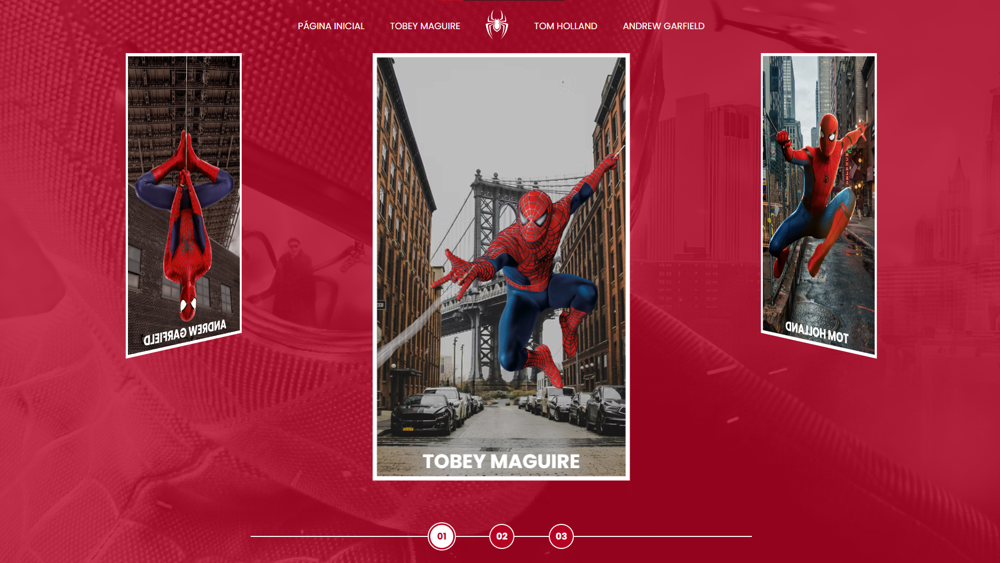

# Spider-Man: Spider-Verse

O projeto é uma galeria de filmes do Homem-Aranha, criada com HTML, CSS e JavaScript, que apresenta uma interface moderna e responsiva. Os filmes são organizados por atores do Homem-Aranha, com cada ator tendo uma página dedicada com sua lista de filmes, os usuários podem navegar pelos filmes. O site oferece uma experiência completa e interativa para os fãs do Homem-Aranha, com design atraente e informações detalhadas sobre os filmes e atores.

## 🚀 Demonstração

[Clique aqui](linkaqui) para acessar o resultado final do projeto.

## 🛠️ Tecnologias Utilizadas

* [HTML](https://developer.mozilla.org/pt-BR/docs/Web/HTML) - Linguagem de Marcação
* [CSS](https://developer.mozilla.org/pt-BR/docs/Web/CSS) - Linguagem de Estilização
* [Javascript](https://developer.mozilla.org/pt-BR/docs/Web/JavaScript) - Linguagem de Programação

## 👨‍💻 Desenvolvedor

    
    
&nbsp&nbsp&nbspFlávio Mattos 
    &nbsp&nbsp&nbsp<a href="https://www.instagram.com/fflaviomattos/">Instagram</a>&nbsp;|&nbsp;<a href="https://github.com/FlavioMattosDev">GitHub</a>&nbsp;|&nbsp;<a href="https://www.linkedin.com/in/flavio-mattos/">LinkedIn</a>&nbsp;

  

---